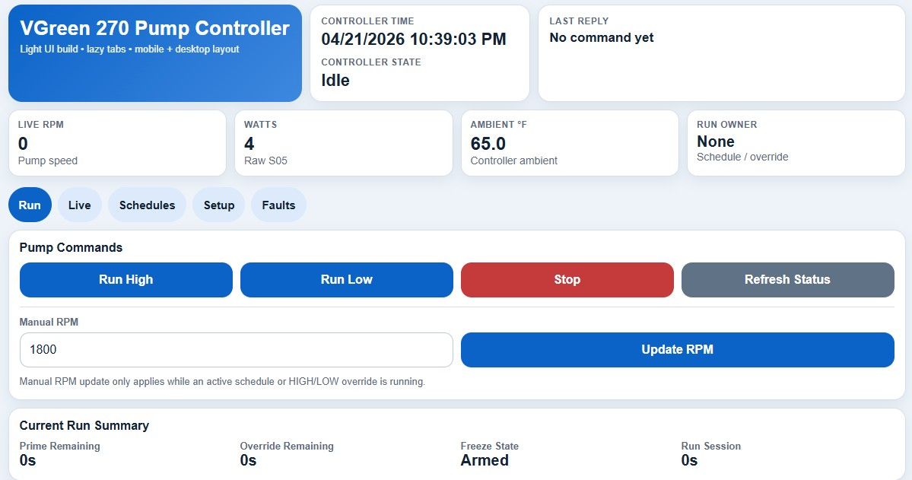
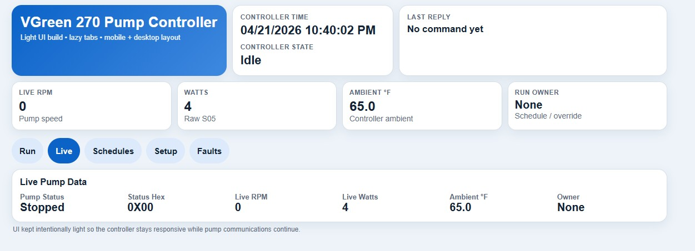
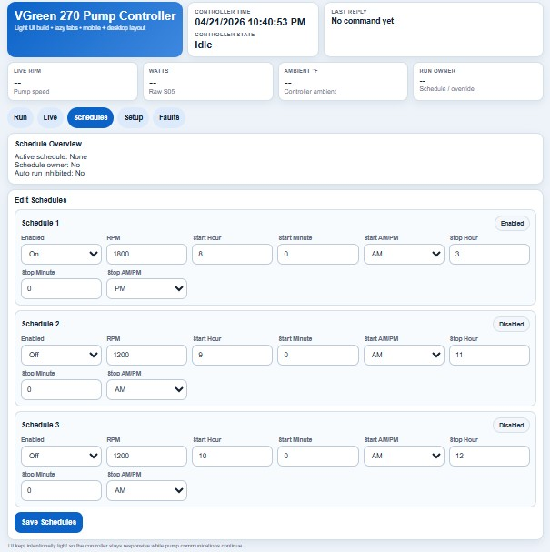
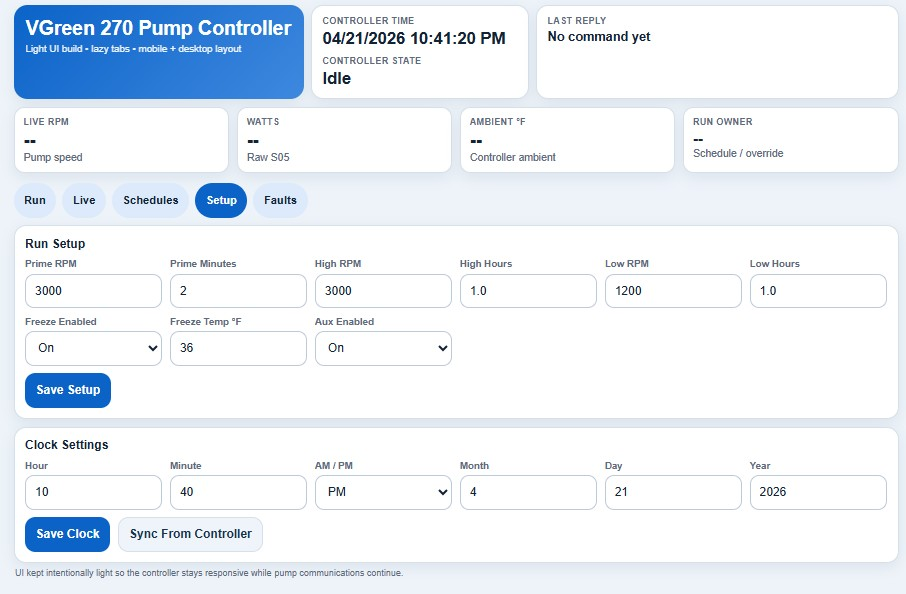
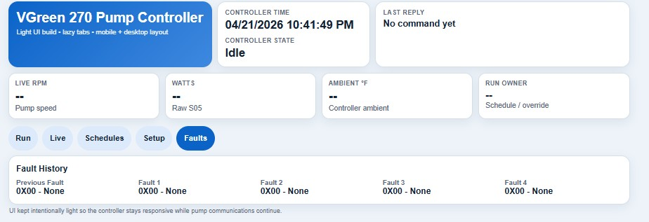
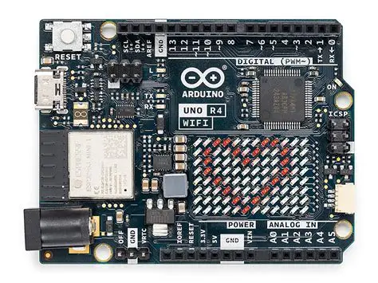
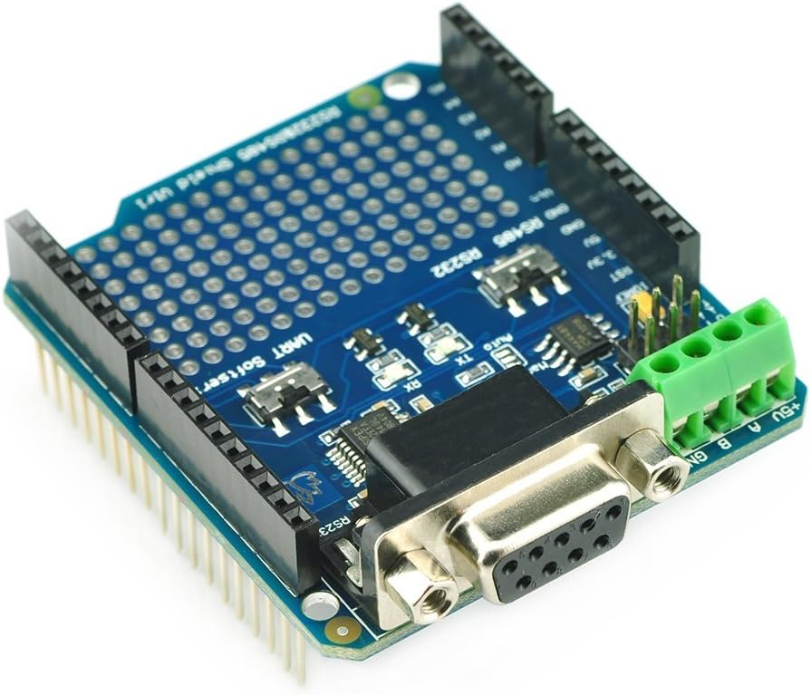
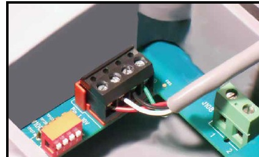
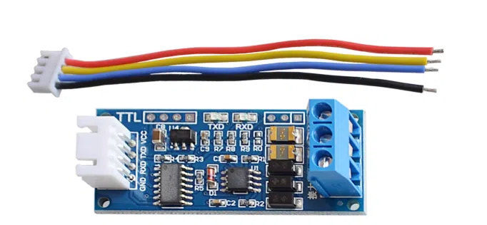

# Century vGreen Pool Pump Controller


---

## 🚀 Overview

This project implements a **robust, standalone pool pump controller** for Century / Regal Beloit vGreen variable-speed pumps.

Built on the **Arduino UNO R4 WiFi**, the system communicates over **RS-485 using a custom EPC protocol** and provides a **lightweight web-based UI** for full local control.

Designed for **continuous operation**, the controller uses:

* Non-blocking architecture
* Command queue execution
* Watchdog-style recovery
* Reliable keepalive communication

---

## 🌐 Device Access & WiFi Modes

> ⚠️ **WiFi Compatibility Note**
> The Arduino UNO R4 WiFi supports **2.4 GHz networks only**.
> It is **not compatible with 5 GHz WiFi networks**.

---

### 🔵 Access Point Mode (Default)

The controller starts in **Access Point (AP) mode**.

* **SSID:** `POOL PUMP` *(default — configurable in code)*
* **Password:** *(blank by default → open network)*

Open in browser:

```id="apurl1"
http://192.168.4.1
```

**Notes:**

* Direct connection to controller
* No internet required
* “No Internet” warning is normal
* SSID/password configurable in code:

```cpp id="apcode"
const char* ssid     = "POOL PUMP";
const char* password = "";
```

---

### 🟢 Home WiFi Mode (Optional)

Controller can connect to your home network:

```cpp id="homewifi"
const char* homeSsid     = "YOUR_HOME_WIFI_SSID";
const char* homePassword = "YOUR_HOME_WIFI_PASSWORD";
```

**Behavior:**

* IP is assigned automatically (DHCP)
* IP may change after reboot or router reset

---

### 📌 Recommended: DHCP Reservation

To keep a consistent IP:

1. Open router settings
2. Find device in connected devices
3. Reserve its IP using MAC address

Example:

```id="staticip"
192.168.1.50
```

---

### 🔁 Mode Behavior

* AP mode is always available
* Home WiFi runs in parallel
* AP remains fallback if home WiFi fails

---

## 🖥️ Web Interface

### ▶️ Run Control



* Start / Stop pump
* Override modes
* Manual RPM adjustment

---

### 📊 Live Telemetry



Displays:

* Pump state
* RPM
* Power (watts)
* Temperature
* Controller state

---

### 📅 Scheduling



* 3 schedules
* Priority-based (1 > 2 > 3)
* RTC-driven
* Prime always enforced

---

### ⚙️ System Setup



Configure:

* Prime settings
* Override settings
* Freeze protection
* Aux relay behavior
* Clock

---

### ⚠️ Fault Monitoring



* Active faults
* Previous faults
* Decoded fault descriptions

---

## 🔌 Hardware

### Controller + Interface




### Pump Interface




---

## 🧩 Architecture

* Command queue prevents collisions
* Start sequence enforces proper startup
* Prime always runs first
* Ramp engine prevents faults
* Keepalive prevents timeout
* Schedule engine uses RTC
* Freeze protection monitors temp
* Watchdog prevents lockups

---

## ❄️ Freeze Protection

* Below setpoint for 30 min → start pump
* Runs at ~1000 RPM
* Above setpoint for 30 min → stop

---

## 🔁 Control Behavior

* All starts: **Prime → Run**
* Prime cannot be interrupted
* Overrides > schedules
* Schedules > idle
* STOP blocks restart until schedule change

---

## 📡 Protocol Notes

* Custom EPC protocol (not Modbus)
* CRC16 (0xA001 polynomial)
* Pump address: `0x15`
* Requires continuous communication

Reference:
https://www.troublefreepool.com/threads/century-regal-vgreen-motor-automation.238733/

---

## 🛠️ Setup

### 1. Upload Code

* Open `.ino` in Arduino IDE
* Select UNO R4 WiFi
* Upload

---

### 2. Configure WiFi

```cpp
const char* ssid     = "POOL PUMP";
const char* password = "";
```

Optional:

```cpp
const char* homeSsid     = "YOUR_HOME_WIFI_SSID";
const char* homePassword = "YOUR_HOME_WIFI_PASSWORD";
```

---

### 3. Connect

#### Direct (Recommended)

1. Connect to `POOL PUMP`
2. Open:

```id="apurl2"
http://192.168.4.1
```

---

#### Home Network

1. Find IP in router
2. Open:

```
http://<assigned-ip>
```

---

### 4. Recommended Network Setup

✔ Set DHCP reservation
✔ Use fixed IP
✔ Bookmark controller

---

### 5. Configure System

* Set clock
* Set schedules
* Set prime
* Verify pump control

---

## 📁 Project Structure

```
Century-vGreen-Pool-Pump-Controller-Arduino-UNO-R4-WIFI/
├── .ino
├── README.md
├── images/
├── docs/
├── hardware/
```

---

## 🚧 Engineering Notes

* Aux relay tied to pump config
* Strict keepalive required
* UI polling impacts performance
* Ramp-down sensitive to faults
* EEPROM + RTC synchronization refined

---

## 📜 Disclaimer

Use at your own risk.
Verify wiring, safety, and compatibility before deployment.
