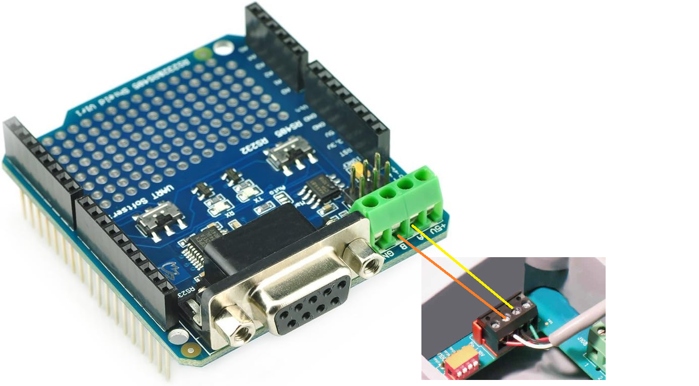

# Century vGreen Pool Pump Controller


---

Compatibility

This project is designed specifically for VGreen 270 models (ECM27SQU / ECM27CU) to ensure proper operation and compatibility.

⚠️ Note: Newer VGreen EVO models are not supported, as they use a different control scheme and communication protocol.

Documentation

To help users verify compatibility and better understand the system, the following reference materials are provided:

VGreen 270 Brochure
VGreen 270 User Manual
VGreen 270 Quick Start Guide

These documents can be used to confirm model compatibility and review pump capabilities before implementation.

---

## ⚡ Quick Start

1. Upload the `.ino` to Arduino UNO R4 WiFi
2. Connect to WiFi: **POOL PUMP**
3. Open browser:

```text
http://192.168.4.1
```

4. Configure settings and start pump

---

## 🚀 Overview

This project is a **robust, standalone pool pump controller** for my Century / Regal Beloit vGreen 270 variable-speed pump. This controller may be compatible with other Century / Regal Beloit vGreen variable-speed pumps, **implement at your own risk**.

Built on the **Arduino UNO R4 WiFi**, the system communicates over **RS-485 using a custom EPC protocol** and provides a **lightweight web-based UI** for full local control.

Designed for **continuous operation**, the controller uses:

* Non-blocking architecture
* Command queue execution
* Watchdog-style recovery
* Reliable keepalive communication

---

## 🌐 Device Access & WiFi Modes

> ⚠️ **WiFi Compatibility Note**
> Arduino UNO R4 WiFi supports **2.4 GHz only** and is **not compatible with 5 GHz WiFi**.

---

### 🔵 Access Point Mode (Default)

* **SSID:** `POOL PUMP`
* **Password:** *(open network by default)*

Open:

```text
http://192.168.4.1
```

**Notes:**

* No internet required
* “No Internet” warning is normal
* SSID and password are configurable in code
* AP mode is useful for direct local access during setup or troubleshooting

```cpp
const char* ssid     = "POOL PUMP";
const char* password = "";
```

---

### 🟢 Home WiFi Mode (Optional)

```cpp
const char* homeSsid     = "YOUR_HOME_WIFI_SSID";
const char* homePassword = "YOUR_HOME_WIFI_PASSWORD";
```

* IP is assigned automatically by your router using DHCP
* The assigned IP may change after reboot, router restart, or lease renewal
* For reliable access, it is recommended to manage IP assignment from your router

---

### 📌 Recommended: Static IP via Router

Assign a DHCP reservation in your router to keep a consistent IP for the controller.

Example:

```text
192.168.1.50
```

This makes it easier to bookmark the controller and avoids having to rediscover its IP after power cycles.

---

### 🔁 Mode Behavior

* AP mode is always available
* Home WiFi can run in parallel
* AP mode remains a fallback if home WiFi fails

---

### 🕒 Clock & Time Synchronization

The controller uses the onboard RTC for schedules and timekeeping.

#### AP Mode

* No internet access means no NTP time sync
* The RTC is used by itself
* Time may drift over long periods

#### Home WiFi Mode

* NTP time synchronization is available
* Clock accuracy is maintained when internet-connected WiFi is available

📌 Recommendation:

* Use home WiFi for accurate long-term schedule timing
* If running AP-only for extended periods, periodically verify or update the clock

---

## 🖥️ Web Interface

### ▶️ Run Control


* Start / Stop
* Override modes
* Manual RPM control

---

### 📊 Live Telemetry


* RPM
* Watts
* Temperature
* Pump state

---

### 📅 Scheduling


* 3 schedules
* Priority-based
* RTC driven
* Prime always enforced

---

### ⚙️ Setup


* Prime settings
* Overrides
* Freeze protection
* Clock
* Aux control

---

### ⚠️ Faults


* Active faults
* Previous faults
* Descriptions

---

## 🔌 Hardware

### UNO R4 WiFi Controller


### RS-485 Shield

* Set switches for UART and RS485


---

### 🔗 RS-485 Wiring



| Controller | Pump |
| ---------- | ---- |
| A / D+     | A    |
| B / D-     | B    |
| GND        | GND  |

📌 Notes:

* Swap A/B if no communication
* Use twisted pair where practical
* Keep wires short
* Verify shield switch settings before testing

---

### Pump Interface


### Optional TTL Adapter

* UNO Pins 0 and 1 to TX and RX


---

## 🧩 Architecture

* Command queue prevents collisions
* Prime-first startup always enforced
* Ramp engine smooths transitions
* Keepalive prevents timeout
* Schedule engine uses RTC
* Freeze protection monitors temperature
* Watchdog helps prevent lockups

---

## ❄️ Freeze Protection

* Below setpoint for 30 minutes → start pump
* Runs at ~1000 RPM
* Above setpoint for 30 minutes → stop

---

## 🔁 Control Behavior

* Start = **Prime → Run**
* Prime cannot be interrupted
* Overrides > schedules
* Schedules > idle
* STOP blocks restart

---

## 📡 Protocol Notes

* Custom EPC protocol (not Modbus)
* CRC16 (0xA001)
* Pump address: `0x15`
* Requires continuous communication

Reference:
https://www.troublefreepool.com/threads/century-regal-vgreen-motor-automation.238733/

---

## 🛠️ Setup

### 1. Upload Code

* Select UNO R4 WiFi
* Upload sketch

---

### 2. Configure WiFi

```cpp
const char* ssid     = "POOL PUMP";
const char* password = "";
```

Optional:

```cpp
const char* homeSsid     = "...";
const char* homePassword = "...";
```

---

### 3. Connect

**Direct:**

```text
http://192.168.4.1
```

**Home WiFi:**

```text
http://<assigned-ip>
```

---

### 4. Configure System

* Set or verify clock
* Set schedules
* Set prime
* Test pump

---

## 🛠️ Troubleshooting

### No Communication with Pump

* Swap A/B wires
* Verify RS485 switch settings
* Confirm Serial1 wiring if using a TTL adapter
* Check pump address (`0x15`)

---

### Cannot Connect to WiFi

* Ensure the network is 2.4 GHz
* Try AP mode first
* Verify credentials in code

---

### UI Freezes / Pump Stops

* Avoid sending rapid repeated commands
* Allow the controller time to complete actions
* Verify communication timing and keepalive behavior

---

### Time Incorrect

* AP mode does not sync time from the internet
* Use home WiFi for NTP synchronization
* Manually verify or update the clock as needed

---

## 📁 Project Structure

```text
Century-vGreen-Pool-Pump-Controller-Arduino-UNO-R4-WIFI/
├── Century-vGreen-Pool-Pump-Controller-Arduino-UNO-R4-WIFI.ino
├── README.md
├── images/
├── docs/
└── hardware/
```

---

## 🚧 Engineering Notes

* Aux relay tied to pump configuration
* Strict keepalive required
* UI polling impacts performance
* Ramp-down can be more fault-sensitive
* EEPROM and RTC synchronization optimized over time

---

## ⚠️ Disclaimer

This project controls electrical equipment.
Use caution and verify all wiring before operation.
